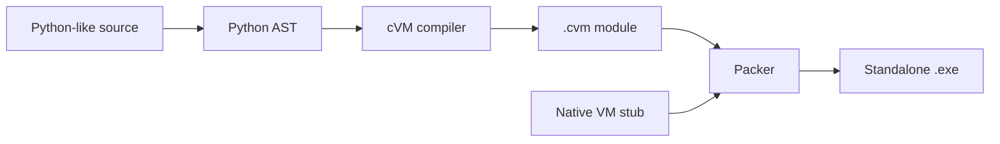

# cVM
{: .fs-9 }

A small Python-like language runtime: a bytecode compiler, a native C virtual machine, and a standalone Windows executable packer.
{: .fs-6 .fw-300 }

[Get started](getting-started.md){: .btn .btn-primary .fs-5 .mb-4 .mb-md-0 .mr-2 }
[Compatibility](COMPATIBILITY.md){: .btn .fs-5 .mb-4 .mb-md-0 .mr-2 }
[View on GitHub](https://github.com/keke2di/c_vm){: .btn .fs-5 .mb-4 .mb-md-0 }

---

{: .new }
v0.2.2 adds real iteration (`range`, `enumerate`, `zip`, iterators, `for/while ... else`), more operators and syntax (bitwise, chained comparisons, unpacking, `del`, comprehension `if`, f-strings), and many built-ins (`sorted`, `sum`, `min`, `max`, `abs`, `round`, `pow`, `ord`, `chr`, `format`, and more). `print` now matches CPython's `repr`/`str`. See the [changelog](CHANGELOG.md).

## What is cVM?

cVM compiles a deliberately limited subset of Python into **CVM2** bytecode and runs it in a native C virtual machine. A compiled program can be packed together with the VM into a single Windows executable.

cVM favors a small, predictable, documented subset over broad Python compatibility. Anything outside that subset is rejected by the compiler or stopped with a runtime error.

## How it works



The compiler parses source with Python's own `ast` module, emits bytecode, and writes a CVM2 module. The packer appends that module to the native VM stub, which loads and validates it when the executable starts.

## A quick example

```python
def describe(name, scores):
    total = sum(scores)
    top = max(scores)
    return f"{name}: {len(scores)} scores, total {total}, best {top}"

people = {"Ada": [88, 91, 79], "Linus": [95, 70]}
for name, scores in sorted(people.items()):
    print(describe(name, scores))
```

Compile, pack, and run it:

```powershell
python -m compiler.cli example.py -o output/example.cvm
python -m packer.pack vm_c/stub.exe output/example.cvm output/example.exe
.\output\example.exe
```

```text
Ada: 3 scores, total 258, best 91
Linus: 2 scores, total 165, best 95
```

The program produces output through `print`; there is no implicit trailing output.

## Documentation

| Page | Contents |
|:-----|:---------|
| [Getting Started](getting-started.md) | Build the VM, then compile, pack, and run a program |
| [Language Reference](LANGUAGE.md) | The supported Python subset |
| [Compatibility](COMPATIBILITY.md) | Support matrix and differences from Python |
| [Bytecode](BYTECODE.md) | Instruction set and calling convention |
| [CVM2 Format](CVM2_FORMAT.md) | Container, module, and packed executable layout |
| [Development](DEVELOPMENT.md) | Repository layout, tests, and debugging |
| [Release Process](RELEASE.md) | How releases are prepared |
| [Changelog](CHANGELOG.md) | Changes in each release |

## Project status

| | |
|:--|:--|
| Current release | **v0.2.2** |
| Platform | Windows, built with MSVC |
| CVM2 format version | 3 |
| Test suite | 180 tests passing |

| Test suite | Tests |
|:-----------|------:|
| Examples | 100 |
| Compiler errors | 18 |
| Container validation | 14 |
| Arithmetic errors | 7 |
| Runtime errors | 31 |
| Runtime stress | 5 |
| Stub | 5 |

{: .warning }
CVM2 does not provide cryptographic protection. Anyone with a `.cvm` file or a packed executable can inspect or extract its bytecode.
